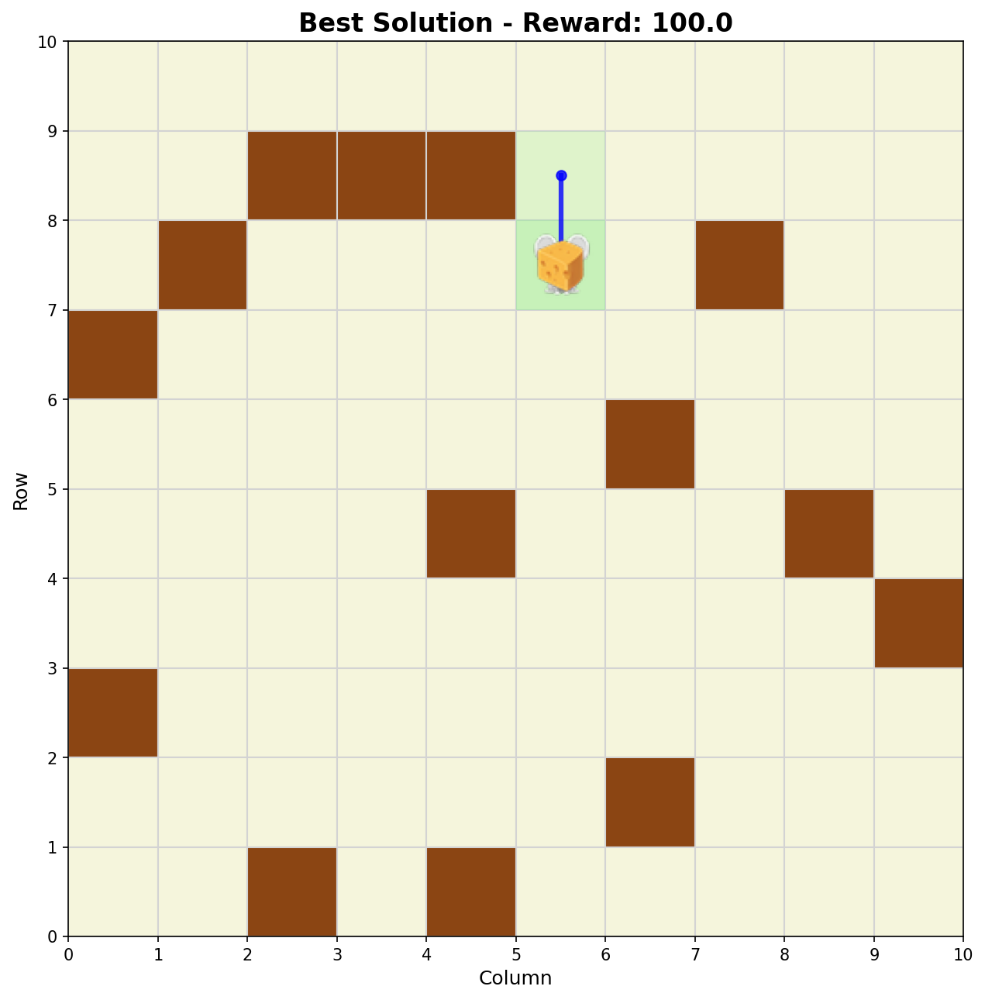
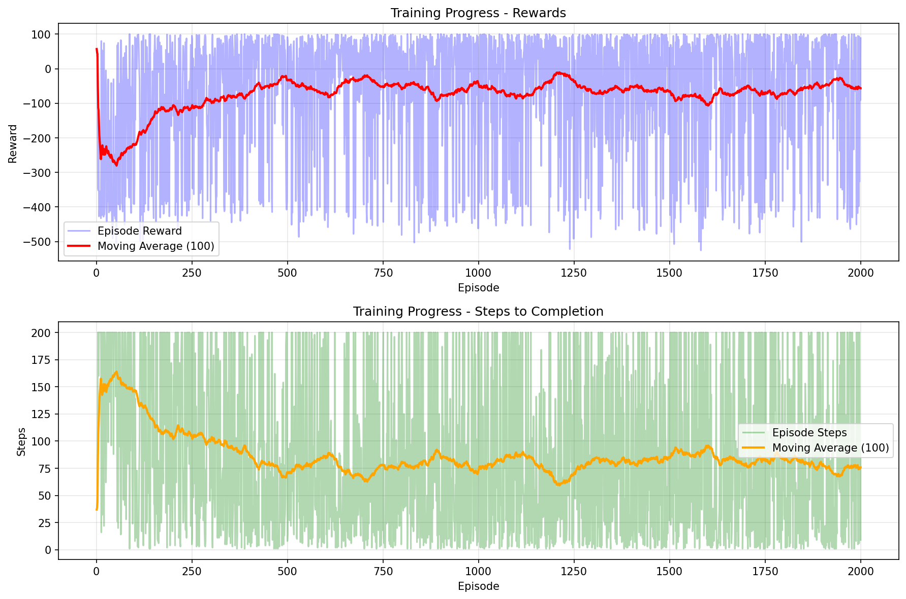
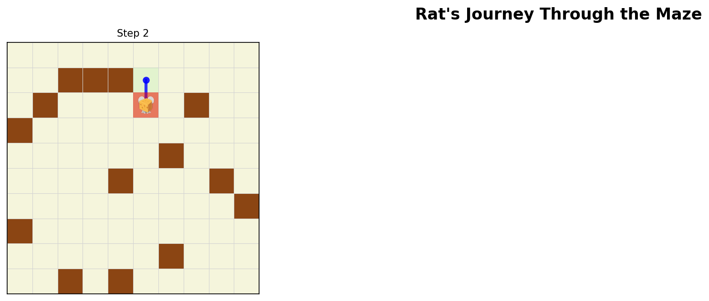
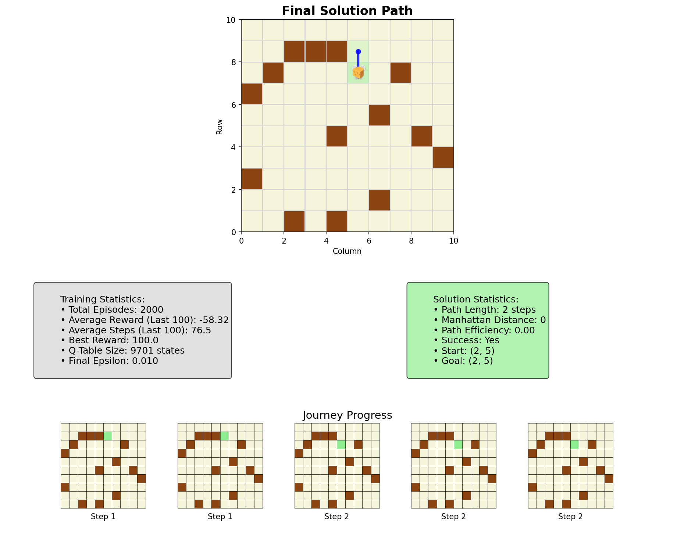

# Maze Q-Learning Agent

A Python AI/ML application that uses OpenAI Gymnasium and Markov Decision Process (Q-Learning) to train an agent to navigate a maze and find cheese.

## Screenshots







## Setup

### Prerequisites
- Python 3.8 or higher
- macOS, Linux, or Windows

### Installation

1. **Clone/Navigate to the project directory**:
   ```bash
   cd Markov_Decision_Process_Agent
   ```

2. **Create and activate virtual environment**:
   ```bash
   python3 -m venv venv
   source venv/bin/activate  # On Windows: venv\Scripts\activate
   ```

3. **Install dependencies**:
   ```bash
   pip install -r requirements.txt
   ```

## Usage

### Basic Training and Evaluation

Run the agent with default settings (10x10 maze, 1000 episodes):
```bash
python main.py
```

### Custom Parameters

Train with custom maze size and episodes:
```bash
python main.py --maze-size 15 --episodes 3000 --eval-episodes 20
```

### Advanced Options

```bash
# Skip visualization generation
python main.py --no-viz

# Load a pre-trained model
python main.py --load-model maze_agent_10x10.pkl --skip-training

# Help and all options
python main.py --help
```